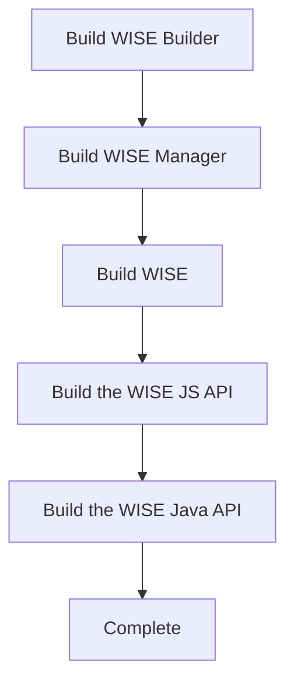

# Building WISE From Source
AUTHOR: spydmobile

## How we do it on github

The building of WISE is not a simple nor trivial thing. Before trying to build it on your own, consider how it is done in our build process in github.

This is best done wiht a series of flow charts.

### Triggering the build.

The first thing that happens is we chnage the version number of the application in a dedicated repo.

We might bump the version from `1.0.6-beta-6` to `1.0.6-beta-7`. This is done by modifying the `versions.properties` in the `WISE_Versions` repo.

This chart shows how that works:

#### Trigger Release Workflow

##### From WISE-Developers/WISE_Versions/main

But really this is more true to render like this:

# Trigger Release Workflow

## From WISE-Developers/WISE_Versions/main

```mermaid
flowchart TB
A0[Trigger Release Workflow]
A1[Build WISE Builder]
A2[Build WISE Manager]
A3[Build WISE]
A4[Build the WISE JS API]
A5[Build the WISE Java API]

A0-->A1
A0-->A2
A0-->A3
A0-->A4
A0-->A5

A1 -->
BB1[checkout]
--WISE-Developers/WISE_Versions-->
B2[checkout]
--WISE-Developers/WISE_Communications_Module-->
B3[checkout]
--WISE-Developers/WISE_Java_API-->
B4[checkout]
--WISE-Developers/WISE_FWI_Module-->
B5[checkout]
--WISE-Developers/WISE_FBP_Module-->
B6[checkout]
--WISE-Developers/WISE_Grid_Module-->
B7[checkout]
--WISE-Developers/WISE_Weather_Module-->
B8[checkout]
--WISE-Developers/WISE_Scenario_Growth_Module-->
B9[checkout]
--WISE-Developers/WISE_Application-->
B1B0[checkout]
--WISE-Developers/REDapp_Lib-->
B1B1[checkout]
--WISE-Developers/WISE_Builder_Component-->
B1B2[Set up JDK 8]
-->
B1B3[Download Math protobuf files]
-->
B1B4[Download Geography protobuf files]
-->
B1B5[Download WTime protobuf files]
-->
B1B6[Unarchive downloaded protobuf files]
-->
B1B7[Setup the Maven configuration file]
-->
B1B8[Load values from versions]
-->
B1B9[Update the version]
-->
B2B0[Download protobuf]
-->
B2B1[Build protobuf]
-->
B2B2[Build Proto definition files]
-->
B2B3[Build the libraries]
-->
B2B4[Archive generated files]
-->
B2B5[Get Last Tags]
-->
B2B6[Tag the repositories]
-->
B2B7[Push versions changes]
--WISE-Developers/WISE_Communications_Module-->
B2B8[Push versions changes]
--WISE-Developers/WISE_Java_API-->
B2B9[Push versions changes]
--WISE-Developers/WISE_FWI_Module-->
B3B0[Push versions changes]
--WISE-Developers/WISE_FBP_Module-->
B3B1[Push versions changes]
--WISE-Developers/WISE_Grid_Module-->
B3B2[Push versions changes]
--WISE-Developers/WISE_Weather_Module-->
B3B3[Push versions changes]
--WISE-Developers/WISE_Scenario_Growth_Module-->
B3B4[Push versions changes]
--WISE-Developers/WISE_Application-->
B3B5[Push versions changes]
--WISE-Developers/REDapp_Lib-->
B3B6[Push versions changes]
--WISE-Developers/WISE_Builder_Component-->
B3B7[Create Builder Release Notes]
-->
B3B8[Create release]
-->
B4B0[Complete]

A2-->
M1[checkout]
--undefined-->
M2[checkout]
--WISE-Developers/WISE_Versions-->
M3[checkout]
--WISE-Developers/WISE_Communications_Module-->
M4[Set up JDK 8]
-->
M5[Setup the Maven configuration file]
-->
M6[Load values from versions]
-->
M7[Update the version]
-->
M8[Download protobuf]
-->
M9[Build protobuf]
-->
M10[Build Proto definition files]
-->
M11[Build the libraries]
-->
M12[Archive generated files]
-->
M13[Tag the repositories]
-->
M14[Push comms changes]
--WISE-Developers/WISE_Communications_Module-->
M15[Push manager changes]
--undefined-->
M16[Create Release Notes]
-->
M17[Create release]
-->
M19[Complete]



A3-->
WA1[checkout]
--undefined-->
WA2[checkout]
--WISE-Developers/WISE_Versions-->
WA3[checkout]
--WISE-Developers/WISE_Processing_Lib-->
WA4[checkout]
--WISE-Developers/REDapp_Lib-->
WA5[checkout]
--WISE-Developers/WISE_REDapp_Lib_Wrapper-->
WA6[checkout]
--WISE-Developers/WISE_FWI_Module-->
WA7[checkout]
--WISE-Developers/WISE_FBP_Module-->
WA8[checkout]
--WISE-Developers/WISE_Grid_Module-->
WA9[checkout]
--WISE-Developers/WISE_Weather_Module-->
WA10[checkout]
--WISE-Developers/WISE_Scenario_Growth_Module-->
WA11[checkout]
--WISE-Developers/WISE_Communications_Module-->
WA12[checkout]
--microsoft/GSL-->
WA13[checkout]
--eclipse/paho.mqtt.c-->
WA14[checkout]
--eclipse/paho.mqtt.cpp-->
WA15[Download LowLevel include files]
-->
WA16[Download ErrorCalc include files]
-->
WA17[Download Multithread include files]
-->
WA18[Download Math include files]
-->
WA19[Download Geography include files]
-->
WA20[Download Geography include files]
-->
WA21[Download Math protobuf files]
-->
WA22[Download Geography protobuf files]
-->
WA23[Download Math protobuf files]
-->
WA24[Download LowLevel lib  - Win]
-->
WA25[Download LowLevel lib  - Ubuntu 20.04]
-->
WA26[Download LowLevel lib  - Ubuntu 22.04]
-->
WA27[Download ErrorCalc lib  - Win]
-->
WA28[Download ErrorCalc lib  - Ubuntu 20.04]
-->
WA29[Download ErrorCalc lib Ubuntu 22.04]
-->
WA30[Download Multithread lib  - Win]
-->
WA31[Download Multithread lib  - Ubuntu 20.04]
-->
WA32[Download Multithread lib Ubuntu 22.04]
-->
WA33[Download Math lib  - Win]
-->
WA34[Download Math lib  - Ubuntu 20.04]
-->
WA35[Download Math lib  - Ubuntu 22.04]
-->
WA36[Download Geography lib  - Win]
-->
WA37[Download Geography lib  - Ubuntu 20.04]
-->
WA38[Download Geography lib  - Ubuntu 22.04]
-->
WA39[Download WTime lib  - Win]
-->
WA40[Download WTime lib  - Ubuntu 20.04]
-->
WA41[Download WTime lib  - Ubuntu 22.04]
-->
WA42[Unarchive downloaded include files]
-->
WA43[Unarchive downloaded Windows libraries]
-->
WA44[Unarchive downloaded Ubuntu 20.04 libraries]
-->
WA45[Unarchive downloaded Ubuntu 22.04 libraries]
-->
WA46[Set up JDK 8  - Win]
-->
WA47[Set up JDK 11  - Ubuntu]
-->
WA48[Setup the Maven configuration file]
-->
WA49[Cache boost]
-->
WA50[Install boost  - Ubuntu]
-->
WA51[Build zlib  - Win]
-->
WA52[Install boost  - Win]
-->
WA53[Setup Ubuntu]
-->
WA54[Download GDAL  - Win]
-->
WA55[Download protobuf]
-->
WA56[Build protobuf  - Win]
-->
WA57[Build protobuf  - Ubuntu]
-->
WA58[Build Proto definition files  - Ubuntu]
-->
WA59[Build Proto definition files  - Win]
-->
WA60[Load values from versions]
-->
WA61[Configure KMLHelper  - Ubuntu]
-->
WA62[Configure KMLHelper  - Win]
-->
WA63[Configure REDappWrapper  - Ubuntu]
-->
WA64[Configure REDappWrapper  - Win]
-->
WA65[Configure FWI  - Ubuntu]
-->
WA66[Configure FWI  - Win]
-->
WA67[Configure FBP  - Ubuntu]
-->
WA68[Configure FBP  - Win]
-->
WA69[Configure Grid  - Ubuntu]
-->
WA70[Configure Grid  - Win]
-->
WA71[Configure Weather  - Ubuntu]
-->
WA72[Configure Weather  - Win]
-->
WA73[Configure Fire Engine  - Ubuntu]
-->
WA74[Configure Fire Engine  - Win]
-->
WA75[Build Comms Proto definition files  - Ubuntu]
-->
WA76[Build Comms Proto definition files  - Win]
-->
WA77[Configure Defaults  - Ubuntu]
-->
WA78[Configure Defaults  - Win]
-->
WA79[Configure Server Comms  - Ubuntu]
-->
WA80[Configure Server Comms  - Win]
-->
WA81[Configure Status  - Ubuntu]
-->
WA82[Configure Status  - Win]
-->
WA83[Build Java  - Ubuntu]
-->
WA84[Build Java  - Win]
-->
WA85[Configure Paho  - Ubuntu]
-->
WA86[Configure Paho  - Win]
-->
WA87[Configure Project  - Ubuntu]
-->
WA88[Configure Project  - Win]
-->
WA89[Generate versions file]
-->
WA90[Configure WISE  - Ubuntu]
-->
WA91[Configure WISE  - Win]
-->
WA92[Build Windows Installer]
-->
WA93[Upload Windows Installer]
-->
WA94[Build Ubuntu 20.04 Installer]
-->
WA95[Upload Ubuntu 20.04 Installer]
-->
WA96[Build Ubuntu 22.04 Installer]
-->
WA97[Upload Ubuntu 22.04 Installer]
-->
WA99[Complete]
A4-->
WJS1[checkout]
--WISE-Developers/WISE_JS_API/main-->
WJS2[checkout]
--WISE-Developers/WISE_Versions-->
WJS3[checkout]
--WISE-Developers/wise_docs-->
WJS4[Load values from versions]
-->
WJS5[Archive files]
-->
WJS6[Archive files]
-->
WJS7[Push documentation changes]
--WISE-Developers/wise_docs-->
WJS8[Tag the repository]
-->
WJS9[Push versions changes]
--WISE-Developers/WISE_JS_API/main-->
WJS10[Create API Release Notes]
-->
WJS11[Create release]
-->
WJS13[Complete]
A5 -->
WJV1[checkout]
--WISE-Developers/WISE_Java_API/main-->
WJV2[checkout]
--WISE-Developers/WISE_Versions-->
WJV3[Set up JDK 8]
-->
WJV4[Load values from versions]
-->
WJV5[Update the version]
-->
WJV6[Build with Maven]
-->
WJV7[Publish package]
-->
WJV8[Tag the repositories]
-->
WJV9[Push changes]
--WISE-Developers/WISE_Java_API/main-->
WJV10[Create Release Notes]
-->
WJV11[Create release]
-->
WJV13[Complete]
```

This represents the build chain in its entirety.

### Next Steps

The flow does not stop there, each 
